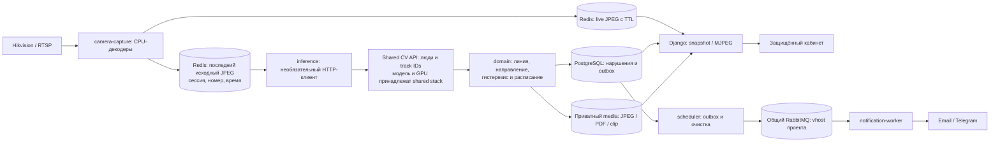

<!-- README.md: Актуальная архитектура, конфигурация и запуск Warehouse Perimeter Watch. -->
# Warehouse Perimeter Watch

Сервис получает RTSP-видео камер склада и показывает его в защищённом кабинете.
CPU-захват работает независимо от распознавания. Для автоматических нарушений
предусмотрен клиент отдельного shared CV API с координатами людей и устойчивыми
ID треков. Контрольная линия, направление, расписание, доказательства, отчёты и
уведомления обрабатываются приложением.

Стек: Python 3.12, Django 5.2, DRF, PostgreSQL 17, Redis 7.4, Celery,
общий RabbitMQ, OpenCV/FFmpeg для CPU-декодирования. Кабинет соответствует
`renders/img.png`. Исходники запущенной сборки доступны после входа по `/source/`;
лицензия — [AGPL-3.0](LICENSE).

## Блок-схема



`camera-capture` запускается всегда и публикует кадры даже при
`VISION_ENABLED=false`, отсутствии CV API или отказе распознавания.
Кнопка «Проверить RTSP» проверяет отдельное подключение; непрерывным просмотром
управляет `camera-capture`. Ни web, ни capture не используют RabbitMQ для видео.

В проекте один `compose.yaml` и один `Dockerfile` со стадиями
`source`, `base`, `ops`, `testing`. Профили: `ops`, `tests`, `inference`.
PostgreSQL, Redis и media принадлежат проекту. Capture и web находятся только
в приватной сети; notification-worker, scheduler, необязательный inference и
одноразовые проверки подключаются к внешней сети `ai-shared`.
RabbitMQ и CV runtime разворачиваются в общей инфраструктуре.
Прикладной проект не устанавливает YOLO/PyTorch/CUDA, не загружает веса и
не назначает физические GPU. Старые профили `gpu`/`cpu` удалены.

**Совместимый shared CV сервис ещё не подтверждён.** Внешний клиент реализован по
[контракту CV API](docs/SHARED_CV_API.md), который требуется согласовать и
реализовать в общей инфраструктуре. Существующий `shared-vlm` с Chat Completions
не реализует этот контракт автоматически. До подтверждения API и проверки
производительности распознавание выключено; новые автоматические нарушения
не создаются. Живое видео, настройки, сохранённая история и отчёты доступны.

## Структура

```text
Dockerfile                    source/base/ops/testing
compose.yaml                  рабочие сервисы и профили ops/tests/inference
.env.example                  шаблон короткого приватного файла
scripts/watch.sh              единый запуск проверок и развёртывания
src/config/                   настройки и маршруты Django
src/core/                     конфигурация и composition root
src/domain/                   геометрия, расписание и общие правила
src/application/              операции и порты
  surveillance/capture.py     публикация JPEG без inference
  surveillance/pipeline.py    нарушения и доказательства по person tracks
src/repositories/             адаптеры Django ORM
src/infrastructure/           Redis, RTSP, HTTP CV API, media, PDF, отправка
src/interface/                CBV, DRF, сериализаторы и HTTP-ошибки
src/accounts_app/             пользователи; прежний label accounts
src/persistence_app/          модели и миграции; прежний label persistence
src/workers/capture.py        CPU-захват всех включённых камер
src/workers/vision.py         необязательный клиент внешнего распознавания
src/workers/celery_app.py      notification-worker и scheduler
static/, templates/           кабинет по renders/img.png
tests/                        unit, functional, regression, architecture,
                              integration, frontend и E2E
docs/                         архитектура, эксплуатация, CV-контракт и приёмка
```

Слои `interface`/`workers` вызывают операции `application`; правила находятся в
`domain`, адаптеры — в `repositories`/`infrastructure`. Реализации собираются в
`core/container.py`. Метки приложений, таблицы и миграции сохранены; `legacy/` удалён.

## `.env` на сервере

На хосте нужны Docker Engine, Compose plugin и Git. `uv` находится в контейнере
и устанавливает зависимости при сборке. Серверные команды `watch.sh` не требуют
Python или `uv` на хосте.

Первый `bash scripts/watch.sh init` создаёт приватный `.env` с правами `600`:

```dotenv
APP_ENV=production
DJANGO_SECRET_KEY=<сгенерированное значение>
CAMERA_CREDENTIALS_KEY=<сгенерированное значение>
POSTGRES_PASSWORD=<сгенерированное значение>
RABBITMQ_PASSWORD=<сгенерированное значение>
```

Сохраните четыре секрета. Повторный `init` не меняет файл. Постоянные настройки
находятся в `src/core/config.py` и `compose.yaml`. Для просмотра RTSP этих пяти
строк достаточно: capture запускается всегда, inference и внешние уведомления
выключены. Удалите устаревшие `VISION_DEVICE`, `VISION_GPU_ID`, `VISION_MODEL`.
Для старого локального vision также уберите `VISION_ENABLED=true`: новый смысл
флага — включение **внешнего CV API**. По умолчанию флаг равен `false`.

Добавляйте только реальные отличия размещения и секреты:

| Ситуация | Строки `.env` |
| --- | --- |
| HTTPS proxy `watch.example.org` | `DJANGO_ALLOWED_HOSTS=localhost,127.0.0.1,watch.example.org`, `DJANGO_CSRF_TRUSTED_ORIGINS=https://watch.example.org` |
| Другая сеть или DNS RabbitMQ | `SHARED_NETWORK=<реальная сеть>`, `RABBITMQ_HOST=<alias или имя контейнера>` |
| Другой адрес публикации web | `WEB_BIND_IP=<IP>`, `WEB_PORT=<порт>` |
| Подтверждённый shared CV API | `VISION_ENABLED=true`, `VISION_INFERENCE_URL=<полный HTTP(S) endpoint из согласованного контракта>`; при авторизации `VISION_INFERENCE_TOKEN=<секрет>` |
| Импорт камер | `CAMERA_INDICES=1,2`, реальные `CAMERA_1_NAME/IP/PORT/PATH/USERNAME/PASSWORD` и `CAMERA_2_*` |
| Внешние уведомления | `NOTIFICATIONS_ENABLED=true` и нужный `EMAIL_NOTIFICATIONS_ENABLED=true` / `TELEGRAM_NOTIFICATIONS_ENABLED=true`; Email: `SMTP_HOST`, `SMTP_USERNAME`, `SMTP_PASSWORD`, `SMTP_FROM_ADDRESS`, при отличии `SMTP_PORT`/`SMTP_USE_TLS`; Telegram: `TELEGRAM_BOT_TOKEN` |

По умолчанию: web `127.0.0.1:8086`, PostgreSQL `postgres:5432`, Redis
`redis://redis:6379/0`, RabbitMQ `rabbitmq:5672`, vhost/user `warehouse-watch`;
захват 5 кадров/с, JPEG TTL 10 секунд, timezone `Europe/Moscow`, хранение 30 дней,
до 16 видимых камер. Реквизиты камеры из кабинета сохраняются в БД зашифрованно.
Для штатного доступа используйте HTTPS proxy. Первичная локальная проверка
доступна через SSH-туннель на `localhost:8086` в Chrome/Firefox.

## Запуск и проверки

Windows, PowerShell из корня проекта:

```powershell
$env:Path = "$env:USERPROFILE\.local\bin;$env:Path"
& "C:\Program Files\Git\bin\bash.exe" scripts/watch.sh browsers
& "C:\Program Files\Git\bin\bash.exe" scripts/watch.sh local-check
```

Сервер после настройки `.env` и запуска RabbitMQ в общей инфраструктуре:

```bash
bash scripts/watch.sh rabbit shared-rabbitmq-1
bash scripts/watch.sh test-containers
bash scripts/watch.sh deploy
bash scripts/watch.sh status
```

`preflight` проверяет секреты, DNS и AMQP-вход из общей Docker-сети.
`rabbit` ждёт готовности выбранного работающего shared брокера и настраивает
проектные vhost/user/права. Остановленный брокер нужно запустить из общей
инфраструктуры. `deploy` выполняет тесты до миграций, запускает capture,
пересоздаёт процессы проекта и удаляет старые контейнеры vision своего Compose.
Администратор: `bash scripts/watch.sh admin`; импорт: `bash scripts/watch.sh import-cameras`.

Полный порядок, диагностика и ручная приёмка:
[OPERATIONS.md](docs/OPERATIONS.md), [VALIDATION.md](docs/VALIDATION.md).
