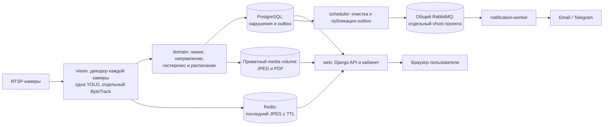

<!-- README.md: Актуальная архитектура, конфигурация и запуск Warehouse Perimeter Watch. -->
# Warehouse Perimeter Watch

Сервис контролирует периметр склада по RTSP-камерам. YOLO обнаруживает людей,
ByteTrack ведёт их траектории, а правила геометрии и расписания определяют
пересечение контрольной линии. Кабинет показывает камеры, нарушения, доказательства
и PDF/CSV отчёты. Внешние уведомления по умолчанию выключены.

Стек: Python 3.12, Django 5.2, DRF, PostgreSQL 17, Redis 7.4, Celery,
общий RabbitMQ и отдельный процесс компьютерного зрения. Интерфейс соответствует
макету `renders/img.png`. Исходники запущенной сборки доступны авторизованному
пользователю по `/source/`; лицензия — [AGPL-3.0](LICENSE).

## Блок-схема



Все сервисы проекта описаны в одном `compose.yaml`. `web`, PostgreSQL, Redis и
media работают в приватной сети. Только `notification-worker`, `scheduler` и
тестовый сервис подключаются к внешней сети `ai-shared`; общий RabbitMQ не входит
в Compose проекта. Профиль `gpu` запускает `vision` с NVIDIA GPU, профиль `cpu` —
`vision-cpu`. Скрипт выбирает профиль по `VISION_DEVICE`. Профиль `tests` использует
отдельные временные PostgreSQL и Redis. Один `Dockerfile` содержит стадии
`source`, `base`, `vision`, `testing`.

В коде `interface` и `workers` вызывают операции `application`; правила лежат в
`domain`. `application` обращается к портам, а `repositories` и `infrastructure`
реализуют доступ к ORM, RTSP, Redis, файлам и внешним каналам.
`core/container.py` связывает реализации в одном месте.

## Структура репозитория

```text
Dockerfile                 стадии source/base/vision/testing
compose.yaml               рабочие сервисы и профили gpu/cpu/tests
.env.example               безопасные значения по умолчанию
scripts/watch.sh           проверки, развёртывание и операции
src/config/                настройки и маршруты Django
src/core/                  конфигурация, сборка зависимостей, запуск
src/domain/                геометрия, расписание и общие правила
src/application/           операции и порты
src/repositories/          адаптеры Django ORM
src/infrastructure/        RTSP, YOLO, Redis, media, PDF, отправка
src/interface/             CBV, DRF, сериализаторы, HTTP-ошибки
src/accounts_app/          пользователи; прежний label accounts
src/persistence_app/       модели и миграции; прежний label persistence
src/workers/               vision, Celery worker и scheduler
templates/, static/        кабинет по renders/img.png
tests/                    unit, functional, regression, architecture,
                          integration, frontend и E2E
docs/                     архитектура, эксплуатация и приёмка
```

Существующие метки приложений, таблицы и миграции сохранены. Старый каталог
`legacy/` удалён после переноса кода.

## Что записать в `.env` на сервере

Сначала установите [`uv`](https://docs.astral.sh/uv/getting-started/installation/)
на сервере и убедитесь, что `uv --version` работает в текущем shell:

```bash
curl -LsSf https://astral.sh/uv/install.sh | sh
export PATH="$HOME/.local/bin:$PATH"
uv --version
```

Из корня проекта выполните `bash scripts/watch.sh init`. Команда создаст `.env`
с четырьмя уникальными значениями: `DJANGO_SECRET_KEY`, `CAMERA_CREDENTIALS_KEY`,
`POSTGRES_PASSWORD`, `RABBITMQ_PASSWORD`. **Сохраните их без изменений и не
публикуйте `.env` в Git.** Если файл уже есть, `init` его не перезаписывает.

Ниже — строки, которые нужно **добавить в созданный `.env` или изменить в нём**
для запуска на сервере с NVIDIA GPU и HTTPS reverse proxy. Замените все значения
в угловых скобках реальными; это не готовые значения для запуска.

```dotenv
APP_ENV=production
DJANGO_DEBUG=false
DATABASE_ENGINE=postgresql
DJANGO_ALLOWED_HOSTS=localhost,127.0.0.1,<ДОМЕН_ИЛИ_IP_ПРОКСИ>
DJANGO_CSRF_TRUSTED_ORIGINS=https://<ДОМЕН_ИЛИ_IP_ПРОКСИ>
DJANGO_SECURE_COOKIES=true
WEB_BIND_IP=127.0.0.1
WEB_PORT=8086

SHARED_NETWORK=ai-shared
RABBITMQ_HOST=rabbitmq
RABBITMQ_PORT=5672
RABBITMQ_VHOST=warehouse-watch
RABBITMQ_USER=warehouse-watch

VISION_ENABLED=true
VISION_DEVICE=0
VISION_GPU_ID=0
VISION_MODEL=models/yolo11n.pt
DEFAULT_TIMEZONE=Europe/Moscow
MEDIA_RETENTION_DAYS=30

CAMERA_INDICES=1,2
CAMERA_1_NAME=Главный вход
CAMERA_1_IP=<IP_ПЕРВОЙ_КАМЕРЫ>
CAMERA_1_PORT=554
CAMERA_1_PATH=<RTSP_ПУТЬ_ПЕРВОЙ_КАМЕРЫ>
CAMERA_1_USERNAME=<ЛОГИН_ПЕРВОЙ_КАМЕРЫ>
CAMERA_1_PASSWORD=<ПАРОЛЬ_ПЕРВОЙ_КАМЕРЫ>
CAMERA_2_NAME=Боковой вход
CAMERA_2_IP=<IP_ВТОРОЙ_КАМЕРЫ>
CAMERA_2_PORT=554
CAMERA_2_PATH=<RTSP_ПУТЬ_ВТОРОЙ_КАМЕРЫ>
CAMERA_2_USERNAME=<ЛОГИН_ВТОРОЙ_КАМЕРЫ>
CAMERA_2_PASSWORD=<ПАРОЛЬ_ВТОРОЙ_КАМЕРЫ>

NOTIFICATIONS_ENABLED=false
EMAIL_NOTIFICATIONS_ENABLED=false
TELEGRAM_NOTIFICATIONS_ENABLED=false
EVENT_CLIP_ENABLED=false
```

`DATABASE_ENGINE=postgresql` и `DJANGO_DEBUG=false` нужны также командам
`watch.sh rabbit` и `watch.sh model`: они читают `.env` до запуска контейнеров.
`POSTGRES_DB=warehouse_watch`, `POSTGRES_USER=warehouse_watch`,
`POSTGRES_HOST=postgres` и `REDIS_URL=redis://redis:6379/0` уже заданы в
`.env.example`; Compose направляет приложение в собственные PostgreSQL/Redis.
Значения `WEB_BIND_IP=127.0.0.1` и `WEB_PORT=8086` предполагают HTTPS proxy на
этом же сервере. Укажите фактический домен proxy в обоих Django параметрах.
Если камер пока нет, запишите `CAMERA_INDICES=` в `.env` и не вызывайте импорт:
их можно будет добавить через кабинет после первого запуска. Адреса
`192.0.2.*` в `.env.example` являются учебными и не подключаются.

Для разработки без GPU используйте `APP_ENV=development`,
`DJANGO_SECURE_COOKIES=false` и `VISION_DEVICE=cpu`; скрипт автоматически выберет
профиль `cpu`. В production при включённом vision нужен GPU.

Для реальной отправки уведомлений задайте `NOTIFICATIONS_ENABLED=true` и флаг
нужного канала. Для почты заполните `SMTP_HOST`, `SMTP_PORT`, `SMTP_USERNAME`,
`SMTP_PASSWORD`, `SMTP_FROM_ADDRESS`, `SMTP_USE_TLS`; для Telegram —
`TELEGRAM_BOT_TOKEN`. Затем добавьте своих получателей и включите бизнес-переключатели
в кабинете. Пока флаги равны `false`, внешней отправки нет независимо от UI.
Остальные настройки и безопасные значения по умолчанию перечислены в `.env.example`.

## Запуск и проверка

На Windows из PowerShell, находясь в корне проекта:

```powershell
& "C:\Program Files\Git\bin\bash.exe" scripts/watch.sh browsers
& "C:\Program Files\Git\bin\bash.exe" scripts/watch.sh local-check
```

На сервере после настройки `.env`:

```bash
bash scripts/watch.sh rabbit shared-rabbitmq-1
bash scripts/watch.sh model
bash scripts/watch.sh test-containers
bash scripts/watch.sh deploy
bash scripts/watch.sh status
```

`deploy` повторяет контейнерные тесты, применяет миграции и пересоздаёт только
сервисы проекта. Перед первым запуском создайте администратора командой
`bash scripts/watch.sh admin`, затем импортируйте настроенные камеры командой
`bash scripts/watch.sh import-cameras`. Полный порядок и ручная приёмка описаны в
[эксплуатации](docs/OPERATIONS.md) и [проверках](docs/VALIDATION.md).

## Ограничения

Автотесты проверяют HTTP, права доступа, правила событий, отчёты и браузерный
интерфейс на синтетических кадрах. Качество YOLO, реальный RTSP, GPU и внешние
каналы нужно проверить на сервере с оборудованием. Доставка уведомлений имеет
семантику «как минимум один раз»: сбой после приёма внешним провайдером может
привести к повторной доставке.
