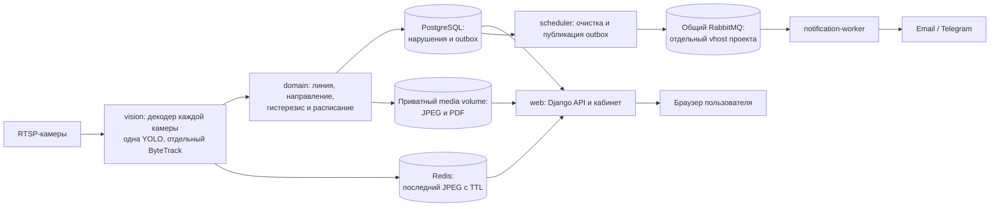

<!-- README.md: Актуальная архитектура, конфигурация и запуск Warehouse Perimeter Watch. -->
# Warehouse Perimeter Watch

Сервис контролирует периметр склада по RTSP-камерам. YOLO обнаруживает людей,
ByteTrack ведёт их траектории, а правила геометрии и расписания определяют
пересечение контрольной линии. Кабинет показывает камеры, нарушения, доказательства
и PDF/CSV отчёты. Внешние уведомления по умолчанию выключены.

Стек: Python 3.12, Django 5.2, DRF, PostgreSQL 17, Redis 7.4, Celery,
общий RabbitMQ и отдельный процесс компьютерного зрения. Интерфейс соответствует
макету `renders/img.png`. Исходники запущенной сборки доступны авторизованному
пользователю по `/source/`; лицензия — [AGPL-3.0](LICENSE).

## Блок-схема



Все сервисы проекта описаны в одном `compose.yaml`. `web`, PostgreSQL, Redis и
media работают в приватной сети. Только `notification-worker`, `scheduler` и
тестовый сервис подключаются к внешней сети `ai-shared`; общий RabbitMQ не входит
в Compose проекта. Профиль `gpu` запускает `vision` с NVIDIA GPU, профиль `cpu` —
`vision-cpu`. При включённом vision скрипт выбирает профиль по `VISION_DEVICE`; по умолчанию
vision выключен. Профиль `tests` использует
отдельные временные PostgreSQL и Redis. Один `Dockerfile` содержит стадии
`source`, `base`, `ops`, `vision`, `testing`.

В коде `interface` и `workers` вызывают операции `application`; правила лежат в
`domain`. `application` обращается к портам, а `repositories` и `infrastructure`
реализуют доступ к ORM, RTSP, Redis, файлам и внешним каналам.
`core/container.py` связывает реализации в одном месте.

## Структура репозитория

```text
Dockerfile                 стадии source/base/ops/vision/testing
compose.yaml               рабочие сервисы и профили gpu/cpu/tests/ops
.env.example               шаблон короткого приватного файла
scripts/watch.sh           проверки, развёртывание и операции
src/config/                настройки и маршруты Django
src/core/                  конфигурация, сборка зависимостей, запуск
src/domain/                геометрия, расписание и общие правила
src/application/           операции и порты
src/repositories/          адаптеры Django ORM
src/infrastructure/        RTSP, YOLO, Redis, media, PDF, отправка
src/interface/             CBV, DRF, сериализаторы, HTTP-ошибки
src/accounts_app/          пользователи; прежний label accounts
src/persistence_app/       модели и миграции; прежний label persistence
src/workers/               vision, Celery worker и scheduler
templates/, static/        кабинет по renders/img.png
tests/                    unit, functional, regression, architecture,
                          integration, frontend и E2E
docs/                     архитектура, эксплуатация и приёмка
```

Существующие метки приложений, таблицы и миграции сохранены. Старый каталог
`legacy/` удалён после переноса кода.

## Что записать в `.env` на сервере

На сервере нужны Docker Engine и Compose plugin. `uv` уже находится внутри образов:
он устанавливает зависимости при сборке. Команды `init`, `rabbit`, `model`,
`preflight`, `test-containers` и `deploy` не требуют `uv` или Python на хосте.

Из корня проекта выполните `bash scripts/watch.sh init`. Служебный контейнер
создаст `.env` с правами `600` и следующими строками:

```dotenv
APP_ENV=production
DJANGO_SECRET_KEY=<сгенерированное значение>
CAMERA_CREDENTIALS_KEY=<сгенерированное значение>
POSTGRES_PASSWORD=<сгенерированное значение>
RABBITMQ_PASSWORD=<сгенерированное значение>
```

Сохраните эти четыре значения. Повторный `init` их не меняет. Не публикуйте
`.env` в Git. Для **первого запуска без камер и GPU** других строк не требуется.
По умолчанию Django работает с PostgreSQL, `DEBUG=false`, защищёнными cookies,
`VISION_ENABLED=false`, внешние уведомления и клипы выключены. PostgreSQL,
Redis, RabbitMQ и сеть имеют адреса из `src/core/config.py` и `compose.yaml`.
Порт `127.0.0.1:8086` задаётся в Compose. Локальный HTTP доступен для
`/health/live` и первичной проверки через Chrome/Firefox
на `localhost`. Для штатного доступа настройте HTTPS reverse proxy: браузеры
по-разному обрабатывают защищённые cookies на локальном HTTP.

Добавляйте в `.env` только значения, отличающиеся от этих настроек:

| Ситуация | Строки в `.env` |
| --- | --- |
| HTTPS proxy с доменом `watch.example.org` | `DJANGO_ALLOWED_HOSTS=localhost,127.0.0.1,watch.example.org` и `DJANGO_CSRF_TRUSTED_ORIGINS=https://watch.example.org` |
| Другое имя общей сети или RabbitMQ | `SHARED_NETWORK=<фактическая сеть>`, `RABBITMQ_HOST=<имя контейнера или alias>` |
| Другой адрес/порт публикации web | `WEB_BIND_IP=<IP>`, `WEB_PORT=<порт>` |
| Запуск обработки видео на GPU | `VISION_ENABLED=true`, `VISION_DEVICE=0`; при выборе другой карты `VISION_GPU_ID=<номер>` |
| Другая модель | `VISION_MODEL=models/<файл.pt>` и файл в `models/` |
| Первичный импорт камер | `CAMERA_INDICES=1,2`, затем реальные `CAMERA_1_NAME/IP/PORT/PATH/USERNAME/PASSWORD` и `CAMERA_2_*` |
| Реальные уведомления | `NOTIFICATIONS_ENABLED=true`, нужный флаг `EMAIL_NOTIFICATIONS_ENABLED` или `TELEGRAM_NOTIFICATIONS_ENABLED`; для Email — `SMTP_HOST`, `SMTP_USERNAME`, `SMTP_PASSWORD`, `SMTP_FROM_ADDRESS` и при необходимости `SMTP_PORT`, `SMTP_USE_TLS`; для Telegram — `TELEGRAM_BOT_TOKEN` |

Секреты камер при создании через кабинет пишутся в БД зашифрованно; строки
`CAMERA_*` нужны только команде импорта. Пример `.env.example` служит
шаблоном; реальные значения по умолчанию находятся в `Settings`.
Срок хранения — 30 дней, часовой пояс — `Europe/Moscow`, максимум видимых
камер — 16. Их можно изменить в настройках объекта, где это предусмотрено.

## Запуск и проверка

На Windows из PowerShell, находясь в корне проекта:

```powershell
& "C:\Program Files\Git\bin\bash.exe" scripts/watch.sh browsers
& "C:\Program Files\Git\bin\bash.exe" scripts/watch.sh local-check
```

На сервере после настройки `.env`:

```bash
bash scripts/watch.sh rabbit shared-rabbitmq-1
bash scripts/watch.sh test-containers
bash scripts/watch.sh deploy
bash scripts/watch.sh status
```

`deploy` повторяет контейнерные тесты, применяет миграции и пересоздаёт только
сервисы проекта. Перед первым запуском создайте администратора командой
`bash scripts/watch.sh admin`, при необходимости импортируйте настроенные камеры командой
`bash scripts/watch.sh import-cameras`. Полный порядок и ручная приёмка описаны в
[эксплуатации](docs/OPERATIONS.md) и [проверках](docs/VALIDATION.md).

## Ограничения

Автотесты проверяют HTTP, права доступа, правила событий, отчёты и браузерный
интерфейс на синтетических кадрах. Качество YOLO, реальный RTSP, GPU и внешние
каналы нужно проверить на сервере с оборудованием. Доставка уведомлений имеет
семантику «как минимум один раз»: сбой после приёма внешним провайдером может
привести к повторной доставке.
