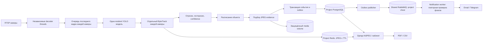
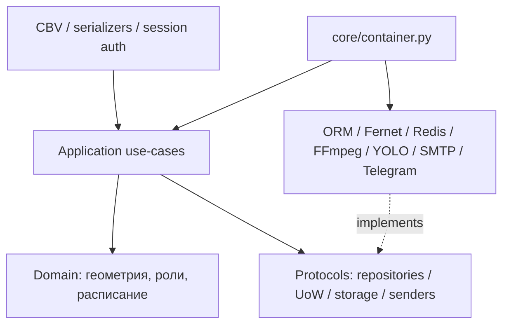
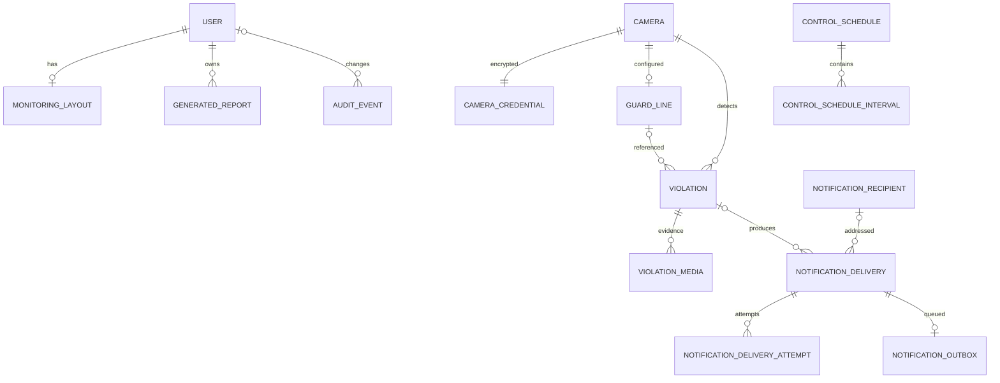

<!-- README.md: Описание продукта, схема слоёв, структура и связи PostgreSQL. -->
# Warehouse Perimeter Watch

Видеоконтроль склада: люди в RTSP-потоках отслеживаются с помощью YOLO и ByteTrack.
Пересечение контрольного отрезка в активное время создаёт нарушение с оригинальным
и размеченным JPEG. Кабинет показывает камеры, историю, доставки и PDF/CSV отчёты.
Интерфейс построен по приложенному рендеру; состояние LIVE появляется только при доступном потоке.

Стек: Python 3.12, Django 5.2, DRF, PostgreSQL 17, Redis 7.4, Celery и shared RabbitMQ.
Собственная resident модель обслуживает все камеры; у каждой камеры свой decoder и tracker.
Проект распространяется под AGPL-3.0: [полный текст лицензии](LICENSE).
Пользователь кабинета может скачать исходный код именно запущенной сборки через `/source/`.

## Возможности

- Регистрация и отключение камер, зашифрованные реквизиты, проверка RTSP, редактирование линии.
- Персональная сетка: выбор, удаление из наблюдения, порядок, плотность и полный экран.
- Гистерезис, минимальный возраст track и confidence, проверка отрезка, направления ENTRY/EXIT.
- Недельное расписание с IANA timezone, ночными интервалами и конечной границей 24:00.
- Подбор лучшего кадра вокруг подтверждённого пересечения; дополнительные MP4 H.264 при включённом флаге.
- Фильтры истории, доказательства, статистика, PDF события и PDF/CSV периода до 2000 событий.
- Email/Telegram: отдельные получатели, durable outbox, состояния и попытки, ограниченные повторы.
- Роли: администратор, оператор, наблюдатель; session authentication и CSRF.

Внешние отправки изначально выключены. Для разрешения нужны `NOTIFICATIONS_ENABLED=true`,
флаг соответствующего канала в `.env` и бизнес-переключатели в кабинете.
UI не может обойти серверные флаги. Redis хранит только кадры с TTL; события остаются в PostgreSQL.

## Структура

    src/config/              настройки Django и маршруты
    src/core/                типизированная конфигурация, DI, logging, timing
    src/domain/              чистые правила геометрии и расписания
    src/application/         use-cases и порты камер, мониторинга, событий, отчётов
    src/repositories/        адаптеры Django ORM
    src/infrastructure/      RTSP, YOLO, Redis, media, PDF, SMTP, Telegram
    src/interface/           CBV, DRF, сериализаторы и HTTP ошибки
    src/accounts_app/        пользователи, роль и миграция с label accounts
    src/persistence_app/     бизнес-модели и миграция с label persistence
    src/workers/             vision и Celery процессы
    templates/, static/      кабинет по рендеру renders/img.png
    tests/                   unit, functional, regression, architecture,
                             integration, frontend и E2E
    scripts/watch.sh         локальные и серверные команды
    legacy/                  архив старой конфигурации вне runtime

Метки Django-приложений `accounts` и `persistence` сохраняют имена существующих
таблиц и историю миграций. Конкретные зависимости собирает `src/core/container.py`;
HTTP views получают готовые factories в маршрутизации.

## Поток обработки





## Связи в базе данных



Раскладка содержит ordered UUID камер в JSON. Событие дополнительно хранит неизменяемые
снимки названия/места камеры и линии. Удаление камеры через API означает отключение,
поэтому история сохраняется. Тестовое уведомление имеет `violation_id=null`.
`NotificationSettings` и `SystemSettings` — отдельные singleton таблицы.

## Запуск и проверки

Все команды выполняются через [scripts/watch.sh](scripts/watch.sh).
На Windows нужен Git Bash, `uv`, Node.js и установленный Chromium; сервер использует
Docker Engine с Compose plugin, `uv`, shared RabbitMQ и NVIDIA Container Toolkit для production vision.

```powershell
# PowerShell, из корня проекта. Секреты для локальных тестов не требуются.
& "C:\Program Files\Git\bin\bash.exe" scripts/watch.sh browsers
& "C:\Program Files\Git\bin\bash.exe" scripts/watch.sh local-check
# По необходимости автоформатирование, затем повтор local-check:
& "C:\Program Files\Git\bin\bash.exe" scripts/watch.sh format
```

Полная последовательность первичного запуска, pull, пересборки, миграций,
сетей и контейнерных тестов: [docs/OPERATIONS.md](docs/OPERATIONS.md).
Правила дальнейшей разработки: [docs/DEVELOPMENT.md](docs/DEVELOPMENT.md).
Результаты текущей проверки и ручная приёмка: [docs/VALIDATION.md](docs/VALIDATION.md).
Полное исходное ТЗ: [docs-specification.md](docs-specification.md).

## Конфигурация и хранение

`.env.example` — полный безопасный каталог. `watch.sh init` создаёт sparse `.env`
с индивидуальными ключами и паролями и сохраняет существующий файл.
IP/пути/пароли камер задаются там же; адреса `192.0.2.*` — примеры, импорт их пропускает.
Credentials шифруются Fernet; ключ нужен для дальнейшей расшифровки существующих камер.
Production vision требует явного GPU device; для разработки предусмотрен `VISION_DEVICE=cpu`.

Срок событий, media, отчётов, попыток и аудита — 1–30 дней, с дополнительным deployment потолком
`MEDIA_RETENTION_DAYS`. Очистка запускается каждую минуту через Celery; orphan файлы тоже очищаются.
При недоступном broker/диске данные удаляются после восстановления; для выполнения политики
нужно наблюдать scheduler и запускать `watch.sh retention` при его отказе.
Redis TTL — 10 секунд по умолчанию. Docker logs ограничены 5 файлами по 10 МБ;
это ограничение объёма, сроки архивов и резервных копий задаются отдельно (до 30 дней).

## Границы проверки

Автоматические проверки используют настоящие Django/HTML/HTTP/PDF и синтетические кадры.
Качество YOLO на конкретном складе, работа GPU, RTSP и внешних каналов требуют
приёмки на сервере с настоящими устройствами. Доставка имеет семантику at least once:
авария после принятия сообщения внешним провайдером до DB commit может вызвать повтор.
Pending evidence до записи события находится в ограниченной памяти worker;
аварийный restart в этот момент может потерять незаписанное событие.
